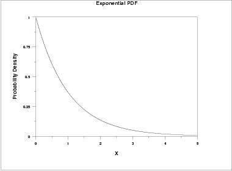

<!-- set knitr options here -->

```{r setup, include=FALSE}
knitr::opts_chunk$set(echo = TRUE)
```

<!-- main body starts here -->

\pagebreak

# Introduction {#intro}


# Background {#sec:background}


# Data collection and preparation

## Problem definition
The *present* model _attempts_ to simulate 


| Gym              | Cycling track     | Swimming            | Studio      | Cycling studio    |
| ---              | -------------     | --------            | ------      | --------------    |
| - Machines       | - Casual cycling  | - Swim for all      | - Yoga      | - Group cycling   |
| - Weight lifting | - Learn to ride   | - Swim for fitness  | - Aerobics  |                   |
|                  | - Better go ride  | - Swim for 60+      | - Pilates   |                   |
|                  |                   | - Swim for women    | - Circuits  |                   |
|                  |                   | - Aqua aerobics     | - Zumba     |                   |
|                  |                   |                     | - Box fit   |                   |


# Simulation Model


## Strategy and approach


# Experiments and tests

## Verification

## Validation


# Scenario testing

## Scenario 1

## Scenario 2


# (TEST ONLY) Maths 

## Equations

- Arrival times are modelled following an exponential distribution: $$ f(x; \lambda) = \lambda e^{-\lambda x} | x\ge 0$$

{width=50%}

\pagebreak


# Appendix 1
- This is the first appendix
- First appendix

\pagebreak


# Appendix 2
Second appendix without listing item

\pagebreak


# Citations 
See for example [@geron01], [@avendi01] and [@chollet01].


